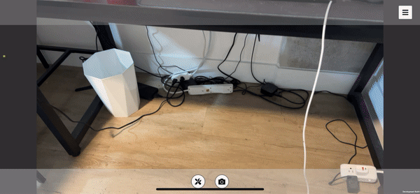

# ARTouchGrass
## SDK
Unity, Apple ARKit iOS, XCode
## Platform
iOS 17.4.1
## Packages Used
AR Foundation, Apple ARKit XR Plugin
## Packages Experimented
[RealtimeHand](https://github.com/ogoguel/realtimehand), OpenCV, Google MediaPipe
## Hardware Requirement
iPhone LiDAR
## Description
AR Touch Grass is an iOS app that aims to provide an AR experience where the user can use their hand to touch any surface, and grass grows from the surfaces they touch. This project is inspired by various interactive art that allows the user to use their body to interact with a screen or a projection. This app hopes to bring a similar artistic experience to AR, with devices that is accessible to most people. This particular implementation is inspired by various mystical creatures that are said to have plants grow wherever they touch. I think this is an interesting concept with a positive connotation. 
## Technical Challenges
There are a few steps required to achieve the effect of having something grow out of any surface you touch. 
1. The surface needs to be identified.
2. The user's hand needs to be recognized to some degree.
3. Real-time collision detection between the hand and the surfaces needs to be implemented.
4. 3D models of grasses need to grow from the identified surfaces and remain there.
## Purposed Methods
First, in order for the surface to be identified, I considered using familiar techniques in Vuforia such as image tracker or virtual buttons. However, these options are either limiting in the space of interaction one can do, or don't quite fit the need. Thus, in order to have a more immersive surface, I remembered iPhone LiDAR is essentially a depth sensor. This limits the development to using Apple ARKit only, which is not ideal but will suffice for now.

Second, after researching for hand tracking package that works with Unity and ARKit, I found that while Apple has invested heavily into hand tracking (Vision Pro's whole interface revolves around hand gestures), ARKit's hand tracking support is only extended to the Apple Vision's version in Unity but not the iOS version. Unity engineers claimed that the underlying code infrastructure between ARKit VisionOS and iOS is different, and that their current top priority is to have VisionOS support. Thus, I found a GitHub Repo [RealtimeHand](https://github.com/ogoguel/realtimehand) that has hand-tracking capabilities, and hopefully, with the current setup, it is able to provide the necessary data.

Third, I intend to use Unity's built-in collision detection to detect the collision between the surface and the hand. This may be more complex than anticipated and require some manual coding.

Finally, I will search for a grass model and place it correctly using surface normals. This may require some GPU optimization if loading many grass object end up being too computationally intensive.
## Progress Update

This GIF demonstrates the surface recognition working on my iPhone. After trying with Vuforia and various other surface recognition packages, I have finally found that ARKit with LiDAR can generate surface meshes. Here, I basically replicated the PolyCam functionality. It was also a struggle to load the Unity project onto the iPhone without a Developer account. However, I figured out the way after a while and it shouldn't be a problem in the future.

## Progress Update 2
Since the last update, I found two more hand-tracking packages: OpenCV and Google Mediapipe. I have experience working with the Python version of OpenCV and Mediapipe before, so I had high hopes for them. While installing these packages, Unity kept crashing, so I took a break and experimented with AR raycasting. 

This GIF demonstrates ray casting with the AR Foundation package. While the final project does not need ray casting, while I was stuck working on hand recognition, I wanted to experiment with something different to see if there were other options for the project. Also, I switched from using ARKit's Mesh scan to AR Foundation's Plane scan. This is more robust in general as it filters out small meshes and only generates horizontal and vertical planes. 

After a while, I finally got Mediapipe to work.

This GIF demonstrates hand tracking with the Google Mediapipe package. It didn't take long to set up the demo, however, after experimenting with manually extracting the hand structure data, I realized it's not as simple as I thought.

First, Google Mediapipe has a lot of dependencies that require a perfect version match to function (i.e. NumPy, CUDA, Python, Wheel, Tensorflow). Second, having it running on iOS requires first building the framework, loading the framework onto the phone, and referencing the framework in Unity. After spending multiple hours on figuring it out, I finally gave up trying to implement the Google Mediapipe hand tracking.

## Progress Update 3
I realized the more complete OpenCV implementation in Unity cost almost $100. This deterred me a little so I spent more time researching OpenCV implementation in Unity before making the purchase. It seems that the bounding box and nodes OpenCV generates are all based on the image plane, which is 2D. This is not ideal as I eventually want to track the node's collision with the planes. Thus, I gave up OpenCV.

Turning my attention again to RealtimeHand, I tried running its demo for hours. However, Unity kept crashing as I was trying to load it. This might be caused by it only updated to Unity 2020.3 while I was trying to run it in 2022.3. Its swift version is also outdated. I naively imported the package onto my main project, which for some reason crashed the whole project and corrupted the file, so I had to restart on a new project. Fortunately, most of my progress so far has been experimenting with new packages and not a lot of coding. 

With no hand-tracking packages left to use, I was put into a bad situation. After some research, I found that while there exists a lot of hand tracking solutions on PCs, due to the lack of lidar, detecting the surface would be difficult. However, due to ARKit not natively supporting hand tracking, it is difficult to implement hand tracking on iOS. After some brainstorming, I remembered the image tracker. I decided to tape an image tracker on the back of my hand to track its location. While it doesn't capture the whole hand geometry, the general location of the hand is sufficient for the goal of this project.

I realized that the AR Foundation has a built-in image tracker function, which is great for consistency. I placed a rectangular cuboid at the image tracker and assigned it a box trigger collider and a rigid body. The plane generated by the scanner also has a mesh collider added. I spent some time to debug this setup, but fortunately, it didn't take long to have it working.

Finally, I used a long rectangular cuboid as a single grass, and created materials for the grass and the auxiliarily models. I wrote some scripts for collision detection and instantiating the grass object at the location of collision. I added some randomness and density checks to make it more organic, and finally, I have a working result.

## Conclusion
The ARTouchGrass project successfully demonstrated the feasibility of integrating hand-tracking and surface interaction in an augmented reality environment using iOS devices with LiDAR. By leveraging Unity, ARKit, and various experimental packages, I developed an app that allows users to interact with virtual environments in a uniquely immersive way—by causing grass to grow on surfaces touched by the user's hand.

### Key Takeaways
- Technological Integration: With hands-on AR development, I realized how many different resources a developer need to leverage in order to create a seemingly simply concept. There are various limitations and advantages to each platform, thus selecting the platform to develop for is also crucial. 
- Creative Approach to Hand Tracking: Despite challenges with native hand-tracking support in iOS, makeshift methods (e.g., image tracker on the hand) proved somewhat effective. This highlights that there may be multiple ways of achieving similar end results during development. 
- Enhanced User Engagement: I am glad I didn't go with a ray casting approach. By turning physical gestures into growth mechanisms within the virtual space, I realized that there is a fundamental desire in humans that want physical contact, which is the beauty of XR technology.
